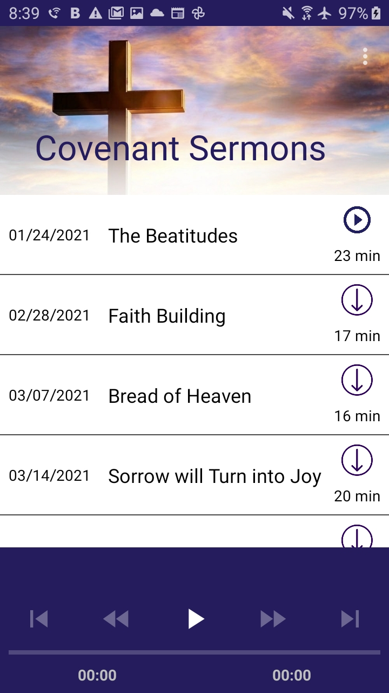
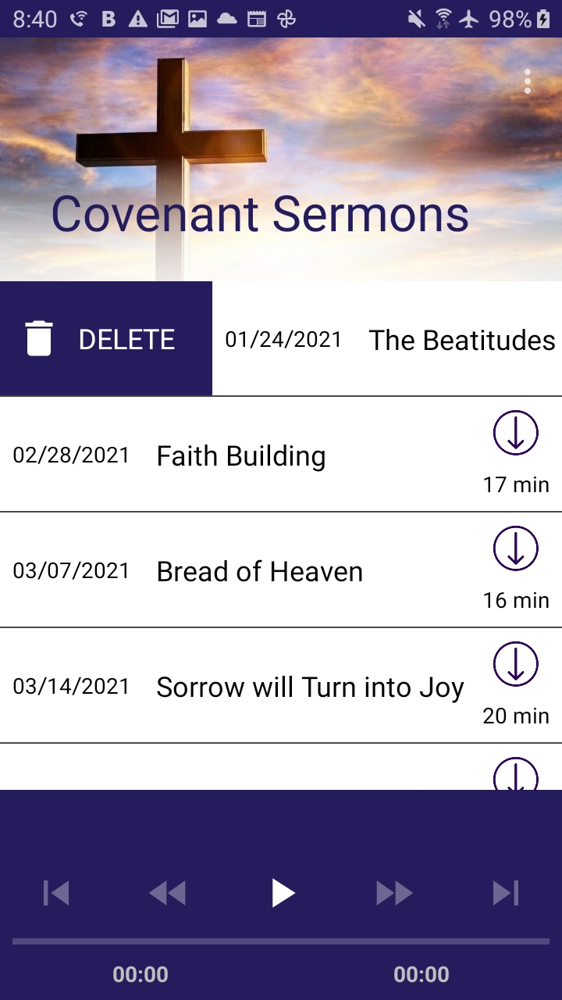
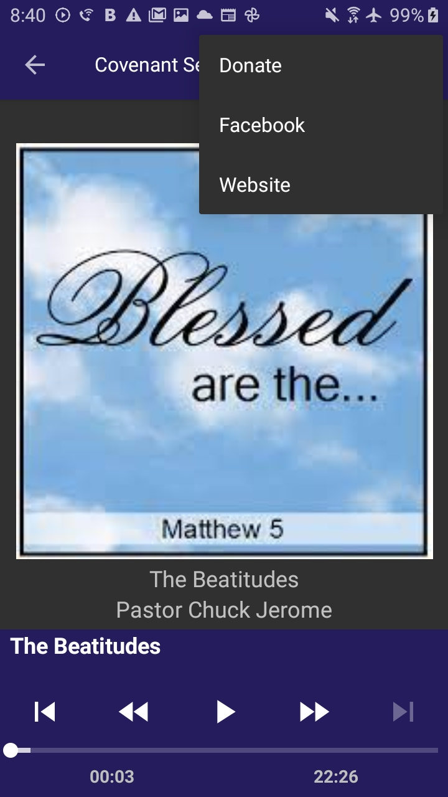
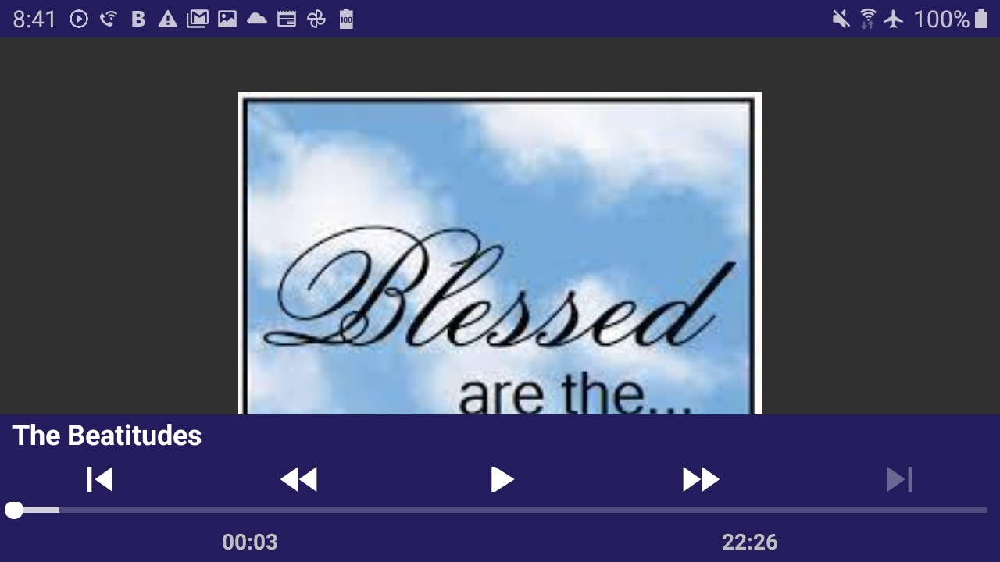
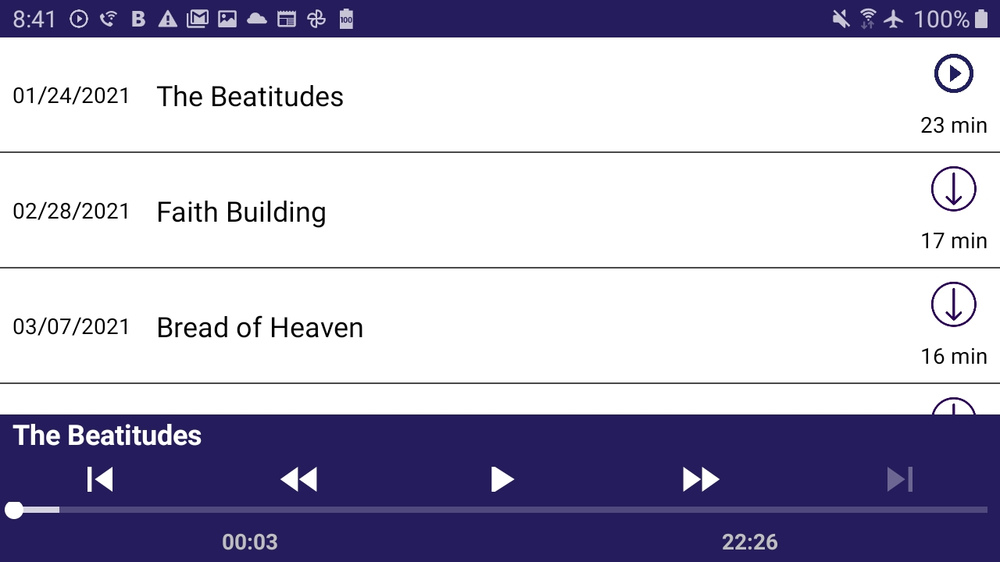

# CovenantSermons

 |
 |

 | |
| ---      | ---       |
| |

## Summary

This is a podcast app that allows you to play podcasts. To listen to a podcast just click the download button and once it is done downloading just click on it. You can close the app and listen to it in the background. You can then change the track in by swiping down and displaying the notification menu. This player allows for all standard controls play, pause, fast forward, rewind, skip and previous. If you are done listening to a podcast and want to save some space just swipe it to the side and it will be removed from the database.

## Libraries

- Exoplayer
- Lifecycle
- Koin
- Timber
- Constraint Layout
- Espresso
- Rxjava
- Firebase
- Multidex
- Glide
- Coroutines
- WorkManager
- Navigation
- AndroidX AppCompat
- RecyclerView

